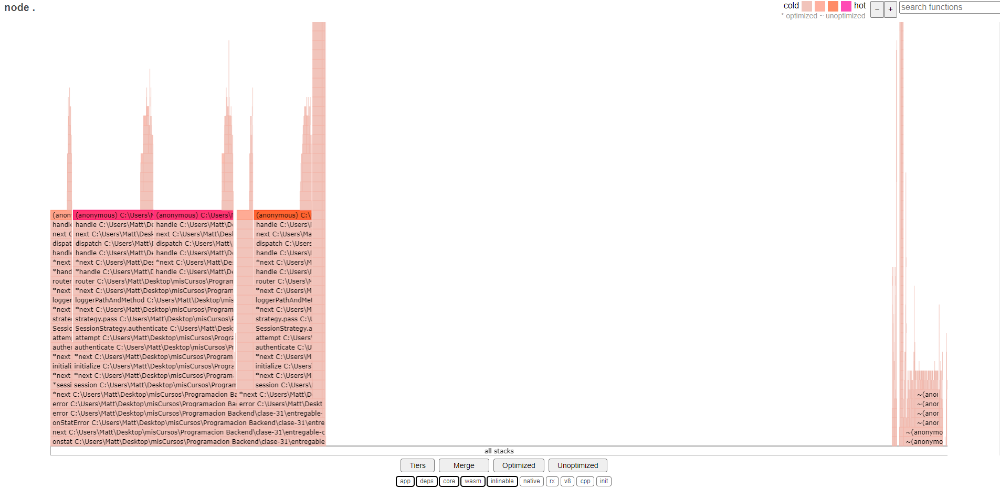

# REPORT

## Artillery

### Resultados del perfilado de Node sin `console.log`

```
 [Summary]:
   ticks  total  nonlib   name
     26    1.2%  100.0%  JavaScript
      0    0.0%    0.0%  C++
     22    1.0%   84.6%  GC
   2172   98.8%          Shared libraries
```


### Resultados del perfilado de Node con `console.log`

```
 [Summary]:
   ticks  total  nonlib   name
     27    1.1%  100.0%  JavaScript
      0    0.0%    0.0%  C++
     19    0.8%   70.4%  GC
   2498   98.9%          Shared libraries
```


## Autocannon

### Con `console.log`

```
Running all benchmarks in parallel...
Running 20s test @ http://localhost:8080/info
100 connections

┌─────────┬────────┬─────────┬─────────┬─────────┬────────────┬───────────┬─────────┐
│ Stat    │ 2.5%   │ 50%     │ 97.5%   │ 99%     │ Avg        │ Stdev     │ Max     │
├─────────┼────────┼─────────┼─────────┼─────────┼────────────┼───────────┼─────────┤
│ Latency │ 619 ms │ 1330 ms │ 1459 ms │ 1493 ms │ 1306.19 ms │ 176.02 ms │ 1504 ms │
└─────────┴────────┴─────────┴─────────┴─────────┴────────────┴───────────┴─────────┘
┌───────────┬────────┬────────┬────────┬────────┬────────┬─────────┬────────┐
│ Stat      │ 1%     │ 2.5%   │ 50%    │ 97.5%  │ Avg    │ Stdev   │ Min    │
├───────────┼────────┼────────┼────────┼────────┼────────┼─────────┼────────┤
│ Req/Sec   │ 65     │ 65     │ 73     │ 85     │ 74.66  │ 5.14    │ 65     │
├───────────┼────────┼────────┼────────┼────────┼────────┼─────────┼────────┤
│ Bytes/Sec │ 114 kB │ 114 kB │ 129 kB │ 150 kB │ 131 kB │ 9.03 kB │ 114 kB │
└───────────┴────────┴────────┴────────┴────────┴────────┴─────────┴────────┘

Req/Bytes counts sampled once per second.

2k requests in 20.17s, 2.63 MB read
```


### Sin `console.log`

```
Running all benchmarks in parallel...
Running 20s test @ http://localhost:8080/info
100 connections

┌─────────┬────────┬─────────┬─────────┬─────────┬────────────┬──────────┬─────────┐
│ Stat    │ 2.5%   │ 50%     │ 97.5%   │ 99%     │ Avg        │ Stdev    │ Max     │
├─────────┼────────┼─────────┼─────────┼─────────┼────────────┼──────────┼─────────┤
│ Latency │ 671 ms │ 1184 ms │ 1660 ms │ 1687 ms │ 1211.61 ms │ 193.9 ms │ 1742 ms │
└─────────┴────────┴─────────┴─────────┴─────────┴────────────┴──────────┴─────────┘
┌───────────┬────────┬────────┬────────┬────────┬────────┬─────────┬────────┐
│ Stat      │ 1%     │ 2.5%   │ 50%    │ 97.5%  │ Avg    │ Stdev   
│ Min    │
├───────────┼────────┼────────┼────────┼────────┼────────┼─────────┼────────┤
│ Req/Sec   │ 60     │ 60     │ 82     │ 92     │ 80.25  │ 8.74    │ 60     │
├───────────┼────────┼────────┼────────┼────────┼────────┼─────────┼────────┤
│ Bytes/Sec │ 106 kB │ 106 kB │ 144 kB │ 162 kB │ 141 kB │ 15.4 kB │ 106 kB │
└───────────┴────────┴────────┴────────┴────────┴────────┴─────────┴────────┘

Req/Bytes counts sampled once per second.

2k requests in 20.17s, 2.82 MB read
```


### Flame Graphs

#### Con `console.log`



#### Sin `console.log`


## Conclusión obtenida a partir del análisis de los datos

`
Vemos que, si bien hay diferencias entre tener un simple console.log y no tenerlo, esa diferencia es mínima y los resultados son muy similares entre sí, pero, entre más console.log hay en nuestro código, el rendimiento del servidor se va a reducir por cada console.log que tengamos.
`